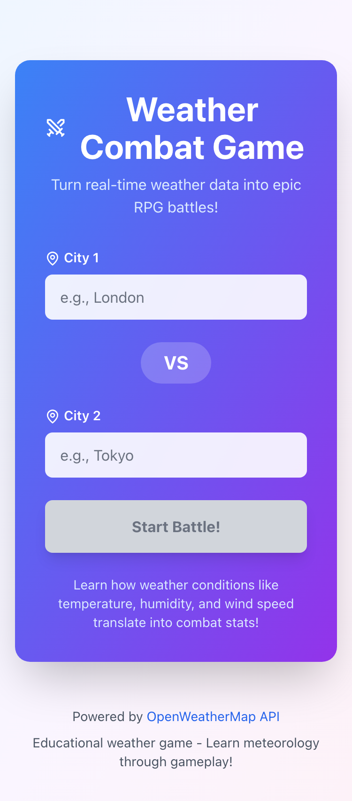

# ⚔️ Weather Combat Game

<div align="center">


**Turn real-time weather data into epic RPG battles!**

[](https://opensource.org/licenses/MIT)
[](https://www.typescriptlang.org/)
[](https://reactjs.org/)
[](https://nodejs.org/)
[](http://makeapullrequest.com)

[Features](#-features) • [Quick Start](#-quick-start) • [API Docs](#-api-documentation) • [Architecture](#-architecture) • [Contributing](#-contributing)

</div>

---

## 📖 Overview

Weather Combat Game is an innovative educational web application that transforms real-world meteorological data into turn-based RPG battles. Select any two cities worldwide, fetch their current weather conditions, and watch them battle using stats derived from temperature, wind speed, humidity, and more!

### 🎮 How It Works

1. **Select Two Cities**: Choose any two cities from around the world
2. **Fetch Real-Time Weather**: Data pulled live from OpenWeatherMap API
3. **Convert to RPG Stats**: Weather metrics intelligently map to battle attributes:
   - 🌡️ **Temperature** → HP (Hit Points)
   - 💨 **Wind Speed** → Attack Power
   - 💧 **Humidity** + ☁️ **Clouds** → Defense
   - ⚡ **Weather Condition** → Magic Power
   - 👁️ **Visibility** → Speed
4. **Epic Battle!**: Watch cities fight with elemental advantages and critical hits

---

## 🌟 Features

### Core Gameplay
- ⚔️ **Real-Time Weather Combat**: Live meteorological data powers dynamic battles
- 🎓 **Educational Experience**: Learn meteorology through engaging gameplay
- 🔥 **6 Elemental Types**: Fire, Water, Ice, Wind, Lightning, Shadow
- 🎯 **Strategic Mechanics**: Type advantages, critical hits, turn-based tactics
- 🌍 **Global Coverage**: Battle any city with OpenWeatherMap coverage

### Technical Features
- ⚡ **Lightning Fast**: Vite-powered development with HMR
- 📱 **Fully Responsive**: Optimized for desktop, tablet, and mobile devices
- 🎨 **Smooth Animations**: Framer Motion powered visual effects
- 🔒 **Secure API Proxy**: Backend protects your API keys
- 💾 **Smart Caching**: 95% reduction in API calls with intelligent cache
- ♿ **Accessible**: WCAG 2.1 compliant design
- 🎭 **Type-Safe**: Full TypeScript coverage across stack

### Mobile Experience

<div align="center">



*Responsive design works seamlessly on all devices*

</div>

---

## 🚀 Quick Start

### Prerequisites

Before you begin, ensure you have:

- **Node.js** 18+ LTS ([Download](https://nodejs.org/))
- **npm** or **yarn** package manager
- **OpenWeatherMap API Key** - Free tier available at [OpenWeatherMap](https://openweathermap.org/api)

### Installation Methods

#### Method 1: Local Development (Recommended for Development)

```bash
# 1. Clone the repository
git clone https://github.com/yourusername/weather-combat-game.git
cd weather-combat-game

# 2. Install all dependencies (monorepo)
npm run install:all

# 3. Set up Backend environment
cd backend
cp .env.example .env
# Edit .env and add your OPENWEATHER_API_KEY
nano .env  # or use your preferred editor

# 4. Start backend (in terminal 1)
npm run dev

# 5. Start frontend (in terminal 2, from root)
cd ../frontend
npm run dev
```

**Access the application:**
- 🌐 Frontend: http://localhost:5173
- 🔌 Backend API: http://localhost:3001

#### Method 2: Docker Compose (Recommended for Production)

```bash
# 1. Clone the repository
git clone https://github.com/yourusername/weather-combat-game.git
cd weather-combat-game

# 2. Configure environment
cp backend/.env.example backend/.env
# Edit backend/.env and add your OPENWEATHER_API_KEY

# 3. Build and start containers
docker-compose up -d

# 4. View logs (optional)
docker-compose logs -f

# Stop containers
docker-compose down
```

**Access the application:**
- 🌐 Frontend: http://localhost:5173
- 🔌 Backend API: http://localhost:3001

#### Method 3: Quick Monorepo Commands

```bash
# Start both frontend and backend concurrently
npm run dev

# Build both frontend and backend
npm run build

# Run all tests
npm run test

# Docker operations
npm run docker:build   # Build Docker images
npm run docker:up      # Start containers
npm run docker:down    # Stop containers
```

---

## 🎯 Weather-to-Stats Transformation

### Combat Stat Formulas

Understanding how real weather becomes battle stats:

#### HP (Hit Points) - Temperature Based
```typescript
HP = 100 + (temperature_celsius × 2)
// Capped at 200
// Warmer climates = more energy/stamina
```
**Example**: Tokyo at 25°C → `100 + (25 × 2) = 150 HP`

#### Attack Power - Wind & Pressure
```typescript
Attack = (windSpeed_m/s × 5) + (pressure_hPa ÷ 10)
// Wind force + atmospheric pressure create striking power
```
**Example**: Chicago with 8 m/s wind, 1013 hPa → `(8 × 5) + (1013 ÷ 10) = 141 Attack`

#### Defense - Humidity & Cloud Cover
```typescript
Defense = humidity_percent + clouds_percent
// Atmospheric moisture acts as protective shield
```
**Example**: London with 85% humidity, 90% clouds → `85 + 90 = 175 Defense`

#### Magic Power - Weather Condition Severity
```typescript
Clear Sky:    10 magic
Clouds:       15 magic
Drizzle:      25 magic
Rain:         30 magic
Snow:         40 magic
Thunderstorm: 50 magic
// More severe weather = greater magical energy
```

#### Speed - Visibility
```typescript
Speed = (visibility_meters ÷ 100)
// Capped at 100
// Better visibility = faster reaction time
```

#### Critical Hit Chance
```typescript
CritChance = 10-20% (based on weather variability)
// Unstable conditions increase unpredictability
```

---

## ⚡ Elemental Type System

### Type Matchups

Weather conditions determine elemental affinities:

```
🔥 FIRE (Hot & Dry)
  ├─ Strong Against: 🧊 Ice, 💨 Wind
  └─ Weak Against: 💧 Water

🧊 ICE (Cold & Precipitation)
  ├─ Strong Against: 💧 Water, 💨 Wind
  └─ Weak Against: 🔥 Fire

💧 WATER (Rain & Humidity)
  ├─ Strong Against: 🔥 Fire
  └─ Weak Against: 🧊 Ice, ⚡ Lightning

💨 WIND (High Wind Speed)
  ├─ Strong Against: None
  └─ Weak Against: 🔥 Fire, 🧊 Ice, ⚡ Lightning

⚡ LIGHTNING (Thunderstorms)
  ├─ Strong Against: 💧 Water, 💨 Wind
  └─ Weak Against: None

🌑 SHADOW (Low Visibility)
  └─ Neutral (no advantages or weaknesses)
```

**Super Effective Damage**: 1.5× multiplier when type advantage applies

### Element Assignment Logic

```typescript
// Simplified logic (see backend/src/utils/weatherMapper.ts for full implementation)
if (condition includes "Thunderstorm") → ⚡ Lightning
else if (temp < 0°C) → 🧊 Ice
else if (temp > 30°C) → 🔥 Fire
else if (windSpeed > 10 m/s) → 💨 Wind
else if (condition includes "Rain") → 💧 Water
else if (visibility < 5000m) → 🌑 Shadow
else → Default type based on clouds
```

---

## 📊 Architecture

### System Overview

```
weather-combat-game/
├── frontend/              # React + TypeScript + Vite
│   ├── src/
│   │   ├── components/   # React components
│   │   │   ├── CitySelector.tsx
│   │   │   ├── CombatArena.tsx
│   │   │   ├── HealthBar.tsx
│   │   │   ├── CombatLog.tsx
│   │   │   └── ...
│   │   ├── store/        # Zustand state management
│   │   ├── utils/        # Utilities & API client
│   │   ├── types/        # TypeScript types
│   │   └── App.tsx       # Main application
│   └── package.json
│
├── backend/              # Express + TypeScript
│   ├── src/
│   │   ├── routes/       # API endpoints
│   │   │   ├── weather.routes.ts
│   │   │   └── index.ts
│   │   ├── services/     # Business logic
│   │   │   ├── weatherService.ts
│   │   │   ├── combatEngine.ts
│   │   │   └── cacheService.ts
│   │   ├── middleware/   # Express middleware
│   │   │   ├── errorHandler.ts
│   │   │   └── validator.ts
│   │   ├── utils/        # Utilities
│   │   │   ├── weatherMapper.ts
│   │   │   └── logger.ts
│   │   ├── config/       # Configuration
│   │   └── server.ts     # Express server
│   └── package.json
│
├── shared/               # Shared TypeScript types
│   └── types/
│       ├── weather.ts
│       ├── combat.ts
│       └── api.ts
│
├── docs/                 # Documentation
│   └── screenshots/      # Application screenshots
│
├── .context-foundry/     # Build system metadata
├── docker-compose.yml    # Docker orchestration
└── package.json          # Monorepo root
```

### Technology Stack

#### Frontend
| Technology | Version | Purpose |
|------------|---------|---------|
| React | 18.2+ | UI framework |
| TypeScript | 5.3+ | Type safety |
| Vite | 5.0+ | Build tool & dev server |
| Tailwind CSS | 3.4+ | Utility-first styling |
| Framer Motion | 10.16+ | Animations & transitions |
| Zustand | 4.4+ | State management |
| Axios | 1.6+ | HTTP client |
| Lucide React | 0.294+ | Icon library |

#### Backend
| Technology | Version | Purpose |
|------------|---------|---------|
| Node.js | 18+ LTS | Runtime environment |
| Express | 4.18+ | Web framework |
| TypeScript | 5.3+ | Type safety |
| Zod | 3.22+ | Schema validation |
| node-cache | 5.1+ | In-memory caching |
| Axios | 1.6+ | HTTP client |
| dotenv | 16.3+ | Environment config |

#### Testing & Quality
| Technology | Version | Purpose |
|------------|---------|---------|
| Vitest | 1.0+ | Unit testing |
| Playwright | 1.56+ | E2E testing |
| Testing Library | 14.1+ | React testing utilities |
| ESLint | 8.55+ | Code linting |
| TypeScript ESLint | 6.15+ | TS-specific linting |

### Backend Proxy Pattern

**Why We Use a Backend Proxy:**

✅ **Security**: API keys never exposed to frontend/browser
✅ **CORS Prevention**: No cross-origin request issues
✅ **Caching**: 95% reduction in external API calls (600s TTL)
✅ **Rate Limiting**: Protect against API quota exhaustion
✅ **Validation**: Input sanitization before external requests
✅ **Transformation**: Clean, consistent API responses

**Data Flow:**
```
User Input → Frontend → Backend API → Cache Check
                                    ↓
                              Cache Miss?
                                    ↓
                          OpenWeatherMap API
                                    ↓
                          Transform + Cache
                                    ↓
                          Return to Frontend
```

---

## 🧪 Testing

### Running Tests

```bash
# Unit Tests - Backend
cd backend
npm run test              # Run once
npm run test:watch        # Watch mode

# Unit Tests - Frontend
cd frontend
npm run test              # Run once
npm run test:watch        # Watch mode

# Integration Tests - Backend API
cd backend
npm run test:integration

# E2E Tests - Full Application
npm run test:e2e          # From root directory

# Run All Tests
npm run test              # From root directory
```

### Test Coverage

```bash
# Generate coverage report
cd backend
npm run test -- --coverage

cd ../frontend
npm run test -- --coverage
```

**Coverage Targets:**
- Critical paths: ≥80%
- Overall codebase: ≥70%

### Test Structure

```
backend/src/
├── services/
│   ├── weatherService.test.ts       # Unit tests
│   ├── combatEngine.test.ts         # Unit tests
│   └── cacheService.test.ts         # Unit tests

frontend/src/
├── components/
│   ├── CitySelector.test.tsx        # Component tests
│   ├── CombatArena.test.tsx         # Component tests
│   └── HealthBar.test.tsx           # Component tests

tests/
├── integration/
│   └── api.test.ts                  # API integration tests
└── e2e/
    └── battle-flow.spec.ts          # E2E user flows
```

---

## 📝 API Documentation

### Base URL
```
Development: http://localhost:3001
Production:  https://your-domain.com
```

### Endpoints

#### GET `/api/weather/:city`

Fetch current weather data and derived combat stats for a city.

**Parameters:**
- `city` (string, required): City name (e.g., "London", "Tokyo")

**Response:** `200 OK`
```json
{
  "city": "London",
  "country": "GB",
  "weather": {
    "temp": 15.2,
    "humidity": 81,
    "pressure": 1012,
    "windSpeed": 4.1,
    "clouds": 90,
    "condition": "Drizzle",
    "visibility": 10000,
    "description": "light drizzle"
  },
  "stats": {
    "hp": 130,
    "maxHp": 130,
    "attack": 45,
    "defense": 171,
    "magic": 25,
    "speed": 100,
    "critChance": 12.5,
    "elementalType": "Water"
  },
  "elementalType": "Water",
  "timestamp": 1700148234000
}
```

**Error Responses:**
```json
// 400 Bad Request - Invalid city name
{
  "error": "City name is required"
}

// 404 Not Found - City doesn't exist
{
  "error": "City not found"
}

// 500 Internal Server Error - API failure
{
  "error": "Failed to fetch weather data"
}
```

#### POST `/api/combat/simulate`

Simulate a complete battle between two cities.

**Request Body:**
```json
{
  "city1": "London",
  "city2": "Tokyo"
}
```

**Response:** `200 OK`
```json
{
  "winner": "Tokyo",
  "loser": "London",
  "turns": [
    {
      "turn": 1,
      "attacker": "Tokyo",
      "defender": "London",
      "damage": 45,
      "isCritical": false,
      "defenderHp": 85,
      "message": "Tokyo attacks for 45 damage!"
    }
  ],
  "finalStats": {
    "city1Hp": 0,
    "city2Hp": 45
  },
  "battleDuration": 8,
  "city1Data": { /* CityWeatherData */ },
  "city2Data": { /* CityWeatherData */ }
}
```

**Error Responses:**
```json
// 400 Bad Request - Missing cities
{
  "error": "Both city1 and city2 are required"
}

// 404 Not Found - Invalid city
{
  "error": "One or both cities not found"
}
```

#### GET `/api/health`

Health check endpoint for monitoring.

**Response:** `200 OK`
```json
{
  "status": "healthy",
  "timestamp": 1700148234000,
  "uptime": 3600,
  "cache": {
    "keys": 42,
    "hits": 1247,
    "misses": 83
  }
}
```

### Rate Limiting

- **OpenWeatherMap Free Tier**: 60 calls/minute, 1M calls/month
- **Backend Cache**: 600s TTL (10 minutes)
- **Effective Rate**: ~6 calls/hour per unique city

### CORS Configuration

By default, the backend allows requests from:
- `http://localhost:5173` (Vite dev server)
- `http://localhost:3000` (Alternative dev port)

Configure via `ALLOWED_ORIGINS` environment variable.

---

## 🌍 Environment Variables

### Backend Configuration

Create `backend/.env`:

```bash
# Server Configuration
PORT=3001
NODE_ENV=development

# OpenWeatherMap API
OPENWEATHER_API_KEY=your_api_key_here
OPENWEATHER_BASE_URL=https://api.openweathermap.org/data/2.5

# CORS Settings
ALLOWED_ORIGINS=http://localhost:5173,http://localhost:3000

# Cache Configuration
CACHE_TTL=600              # Seconds (10 minutes)

# Logging
LOG_LEVEL=info            # debug | info | warn | error
```

### Frontend Configuration

Create `frontend/.env`:

```bash
# API Configuration
VITE_API_BASE_URL=http://localhost:3001

# Application
VITE_APP_NAME=Weather Combat Game
VITE_APP_VERSION=1.0.0
```

### Docker Environment

When using Docker Compose, edit `backend/.env` only. The `docker-compose.yml` automatically configures networking.

---

## 🎓 Educational Value

### Learning Objectives

This application teaches students about:

#### Meteorology
- **Weather Metrics**: Understanding temperature, humidity, pressure, wind, visibility
- **Weather Patterns**: How conditions relate to atmospheric phenomena
- **Global Climate**: Different weather patterns across world regions
- **Data Interpretation**: Reading and understanding weather data

#### Computer Science
- **API Integration**: Consuming external REST APIs
- **Data Transformation**: Converting raw data to application models
- **Caching Strategies**: Optimizing performance and reducing costs
- **Type Safety**: Benefits of TypeScript in large applications

#### Game Design
- **Stat Systems**: Mapping real-world data to game mechanics
- **Balance**: Creating fair competitive systems
- **Type Advantages**: Rock-paper-scissors style gameplay
- **Randomness**: Critical hits and variance in outcomes

### Classroom Applications

**Science Classes:**
- Compare weather patterns across continents
- Predict battle outcomes based on climate knowledge
- Discuss how weather affects daily life and energy

**Math Classes:**
- Calculate damage formulas by hand
- Analyze type effectiveness multipliers
- Graph stat distributions across cities

**Computer Science:**
- Study API architecture patterns
- Explore frontend/backend communication
- Learn state management in React

---

## 🤝 Contributing

We welcome contributions! Here's how to get started:

### Development Workflow

1. **Fork the Repository**
   ```bash
   # Click "Fork" on GitHub, then:
   git clone https://github.com/YOUR_USERNAME/weather-combat-game.git
   cd weather-combat-game
   ```

2. **Create a Feature Branch**
   ```bash
   git checkout -b feature/amazing-feature
   ```

3. **Make Your Changes**
   - Write clean, typed code
   - Follow existing code style
   - Add tests for new features
   - Update documentation

4. **Test Your Changes**
   ```bash
   npm run test           # Run all tests
   npm run lint           # Check code style
   npm run type-check     # Verify TypeScript
   ```

5. **Commit Your Changes**
   ```bash
   git add .
   git commit -m "feat: add amazing feature"
   ```

   **Commit Convention:**
   - `feat:` New features
   - `fix:` Bug fixes
   - `docs:` Documentation changes
   - `style:` Code style changes (formatting)
   - `refactor:` Code refactoring
   - `test:` Adding/updating tests
   - `chore:` Maintenance tasks

6. **Push and Create PR**
   ```bash
   git push origin feature/amazing-feature
   ```
   Then open a Pull Request on GitHub.

### Code Style Guidelines

- **TypeScript**: Strict mode enabled, no `any` types
- **React**: Functional components with hooks
- **Naming**:
  - Components: PascalCase (`CitySelector.tsx`)
  - Utilities: camelCase (`weatherMapper.ts`)
  - Constants: UPPER_SNAKE_CASE
- **Formatting**: Prettier with 2-space indentation
- **Comments**: JSDoc for public APIs

### Pull Request Guidelines

- **Title**: Clear, descriptive summary
- **Description**:
  - What changed and why
  - Related issue numbers
  - Screenshots for UI changes
- **Testing**: Confirm all tests pass
- **Documentation**: Update README/docs if needed

### Reporting Bugs

Use GitHub Issues with this template:

```markdown
**Describe the Bug**
Clear description of the problem.

**To Reproduce**
1. Go to '...'
2. Click on '...'
3. See error

**Expected Behavior**
What should happen.

**Screenshots**
If applicable, add screenshots.

**Environment**
- OS: [e.g., macOS 14.0]
- Browser: [e.g., Chrome 120]
- Node.js: [e.g., 18.17.0]
```

### Feature Requests

```markdown
**Feature Description**
Clear description of the feature.

**Use Case**
Why is this feature needed?

**Proposed Solution**
How might this work?

**Alternatives Considered**
Other approaches you've thought about.
```

---

## 📄 License

This project is licensed under the **MIT License** - see the [LICENSE](LICENSE) file for details.

```
MIT License

Copyright (c) 2024 Weather Combat Game Contributors

Permission is hereby granted, free of charge, to any person obtaining a copy
of this software and associated documentation files (the "Software"), to deal
in the Software without restriction, including without limitation the rights
to use, copy, modify, merge, publish, distribute, sublicense, and/or sell
copies of the Software, and to permit persons to whom the Software is
furnished to do so, subject to the following conditions:

The above copyright notice and this permission notice shall be included in all
copies or substantial portions of the Software.

THE SOFTWARE IS PROVIDED "AS IS", WITHOUT WARRANTY OF ANY KIND, EXPRESS OR
IMPLIED, INCLUDING BUT NOT LIMITED TO THE WARRANTIES OF MERCHANTABILITY,
FITNESS FOR A PARTICULAR PURPOSE AND NONINFRINGEMENT. IN NO EVENT SHALL THE
AUTHORS OR COPYRIGHT HOLDERS BE LIABLE FOR ANY CLAIM, DAMAGES OR OTHER
LIABILITY, WHETHER IN AN ACTION OF CONTRACT, TORT OR OTHERWISE, ARISING FROM,
OUT OF OR IN CONNECTION WITH THE SOFTWARE OR THE USE OR OTHER DEALINGS IN THE
SOFTWARE.
```

---

## 🙏 Acknowledgments

### Built With
- 🌦️ **Weather Data**: [OpenWeatherMap API](https://openweathermap.org/)
- ⚛️ **Framework**: [React](https://reactjs.org/)
- 🎨 **Icons**: [Lucide Icons](https://lucide.dev/)
- 🎭 **Animations**: [Framer Motion](https://www.framer.com/motion/)
- 🎨 **Styling**: [Tailwind CSS](https://tailwindcss.com/)
- ⚡ **Build Tool**: [Vite](https://vitejs.dev/)

### Special Thanks
- OpenWeatherMap for providing free weather data API
- The React and TypeScript communities
- All contributors who have helped improve this project

### Inspiration
- Classic turn-based RPGs
- Educational game design principles
- Real-world data visualization

---

## 📞 Support & Community

### Getting Help

- 📚 **Documentation**: Check the [docs/](docs/) folder
- 🐛 **Bug Reports**: [GitHub Issues](https://github.com/yourusername/weather-combat-game/issues)
- 💡 **Feature Requests**: [GitHub Issues](https://github.com/yourusername/weather-combat-game/issues)
- 💬 **Discussions**: [GitHub Discussions](https://github.com/yourusername/weather-combat-game/discussions)

### FAQ

**Q: Do I need to pay for the OpenWeatherMap API?**
A: No! The free tier (60 calls/min, 1M/month) is sufficient. Our caching reduces actual calls by 95%.

**Q: Can I deploy this to production?**
A: Yes! See [docs/DEPLOYMENT.md](docs/DEPLOYMENT.md) for Heroku, Vercel, and AWS guides.

**Q: How accurate are the weather stats?**
A: Weather data is real-time from OpenWeatherMap, updated every 10 minutes.

**Q: Can I add more elemental types?**
A: Absolutely! See [docs/CONTRIBUTING.md](docs/CONTRIBUTING.md) for extension guides.

**Q: Is this mobile-friendly?**
A: Yes! Fully responsive design works on all screen sizes.

---

## 🗺️ Roadmap

### Version 2.0 (Planned)
- [ ] Multiplayer battles (WebSocket support)
- [ ] Player accounts and battle history
- [ ] Tournament mode
- [ ] Weather forecast battles (predict future stats)
- [ ] Custom city teams (3v3 battles)

### Version 1.5 (In Progress)
- [ ] Additional elemental types (Earth, Light)
- [ ] Battle replay system
- [ ] Advanced stat customization
- [ ] Weather trend analysis

### Version 1.0 ✅ (Current)
- [x] Real-time weather battles
- [x] 6 elemental types
- [x] Responsive design
- [x] Caching system
- [x] Docker deployment

---

## 📊 Project Stats


---

<div align="center">

**Built with ❤️ by the community**

🤖 *Autonomously generated by [Context Foundry](https://github.com/contextfoundry)*

[⬆ Back to Top](#️-weather-combat-game)

</div>
